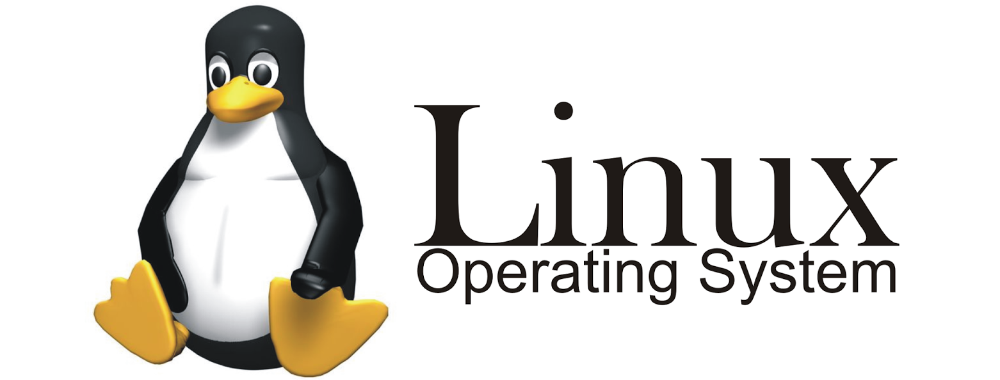

**CMP 337 Linux**

**Course Objectives:**

1.  To provide a strong knowledge of the open-source operating system.

2.  To provide knowledge of the server program in the operating system.

---

### Course Contents:

**Unit I: Introduction 2 hours**

1. Linux:
   i. History
   ii. Introduction
2. Advantages of Linux over other operating systems
3. FAT, NTFS, EXT
4. Culture of free software

**Unit II: Basics of Linux 5 hours**

1.  Commands
2.  Shells:
    i. Csh
    ii. Ksh
    iii. Bash
3.  Text Editors:
    i. Vim
    ii. Pico
4.  The file system of Linux
5.  Directories and their special purpose

**Unit III: Installation of Linux 3 hours**

1.  Partitioning
2.  Installation of Linux
3.  Troubleshooting of installation

**Unit IV: System Administration 6 hours**

1.  Root login
2.  Superuser
3.  Configuration of hardware with kudzu
4.  Checking system space
5.  Monitoring system performance
6.  Working with a file system
7.  Configuring modules

**Unit V: User Management 6 hours**

1.  Creating user accounts
2.  Setting user defaults
3.  Providing support to users
4.  Modifying accounts
5.  Deleting user accounts
6.  Checking disk quotas
7.  Sending mail to all users

**Unit VI: Security and System Handling  6 hours**

1.  Understanding shell scripts
2.  System startup and shutdown
3.  Scheduling system tasks
4.  Backing up and restoring
5.  Password protection
6.  File security

**Unit VII: Setting up a Web Server 4 hours**

1.  Introduction to a web server
2.  Starting the Apache web server
3.  Configuring the Apache web server
4.  Monitoring server activities

**Unit VIII: Setting up DHCP and NIS 5 hours**

1.  Introduction to DHCP
2.  Setting up a DHCP server
3.  Setting up DHCP client
4.  Understand NIS

**Unit IX: Setting up a Database Server 5 hours**

1.  Configuring database server
2.  Checking the status
3.  Working with database

**Unit X: Setting up DNS Server 4 hours**

1.  Introduction to DNS
2.  Setting up DNS and > configuration
3.  Querying DNS

**Unit XI: ISP Simulation 2 hours**

1.  Integration of servers
2.  DNS, Web, Email, etc.

**List of Practical:**

1.  Linux utilities
2.  OS installation project work
3.  User management using a terminal
4.  Security level access control list
5.  Network setting
6.  Server configuration of DHCP, DNS, Database server
7.  Demonstration of the web, mail, file server.

**Text Book:**

1.  Christopher Negus: Red Hat Linux 8.0, Bible, WILEY

**Reference Books:**

1. Neil Jankins and Stanschat: Understanding Local Area Networks, PHI

2. Andrew S. Tanenbaum: Computer Networks, PHI
