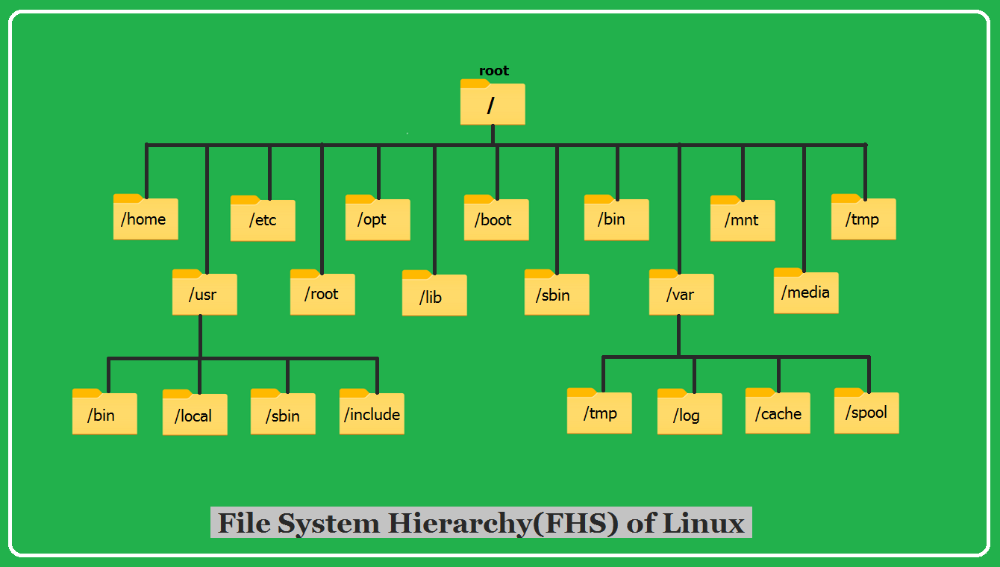

The file system in Linux is a critical component of the operating system that manages how files and directories are organized and stored on storage devices, such as hard drives and solid-state drives. Linux employs a hierarchical directory structure, which means that files and directories are organized in a tree-like fashion. Let's explore the key aspects of the Linux file system in detail:

**1. Hierarchical Directory Structure:**

- Linux follows a hierarchical or tree-like directory structure, with the root directory (`/`) at the top. All files and directories are organized under the root directory.
- Directories can contain both files and subdirectories, forming a nested structure.

**2. Root Directory (/):**

- The root directory is the top-level directory in the file system hierarchy.
- It is represented by a forward slash `/` and is the starting point for all file paths in Linux.

**3. Standard Directories:**

- Linux defines several standard directories with specific purposes. Some of the most common ones include:
  - `/bin`: Contains essential system binaries (executable files) required for system boot and repair.
  - `/etc`: Stores system-wide configuration files.
  - `/home`: Home directories for user accounts.
  - `/lib` and `/lib64`: Libraries required for programs and system functions.
  - `/usr`: Contains user binaries, libraries, and documentation.
  - `/var`: Variable data, such as logs and spool files.
  - `/tmp`: Temporary files.
  - `/dev`: Device files, representing hardware devices.
  - `/mnt` and `/media`: Mount points for removable media.

**4. File Types:**

- In Linux, everything is considered a file. This includes regular files, directories, device files, and more.
- Common file types include regular files (containing data), directories (for organizing files), symbolic links (shortcuts to other files or directories), and device files (representing hardware devices).

**5. File Permissions:**

- Linux uses a robust permission system to control who can access and modify files and directories.
- Each file and directory has associated permissions for the owner, group, and others (world). Permissions can be set to read, write, and execute for each of these categories.
- File ownership and permissions are essential for security and access control.

**6. Mount Points:**

- In Linux, storage devices are attached to the file system through mount points.
- When a device is mounted, its contents become accessible within the directory specified as the mount point.
- This allows Linux to manage various storage devices, including hard drives, USB drives, and network shares, seamlessly.

**7. Filesystem Types:**

- Linux supports various filesystem types, such as Ext4, Ext3, XFS, and Btrfs.
- The choice of filesystem type depends on factors like performance, reliability, and use case.

**8. Virtual Filesystems:**

- Linux also features virtual filesystems, such as `/proc` and `/sys`, which provide access to kernel and hardware information.
- `/proc` contains information about running processes and system configuration.
- `/sys` exposes information and configuration options related to hardware and devices.

**9. Filesystem Hierarchy Standard (FHS):**

- The Filesystem Hierarchy Standard is a set of guidelines and practices for maintaining a consistent directory structure across Linux distributions. It helps ensure compatibility and ease of use across different systems.

**10. Filesystem Commands:**

- Users and administrators interact with the file system using commands like `ls` (list files and directories), `cd` (change directory), `mkdir` (create directory), `touch` (create files), and many others.

In conclusion, the Linux file system is a foundational part of the operating system, responsible for organizing, managing, and providing access to data and system resources. Its hierarchical structure, permission system, and support for various filesystem types make it a robust and versatile component of Linux. Understanding how to navigate and work with the file system is fundamental for Linux users and administrators.
