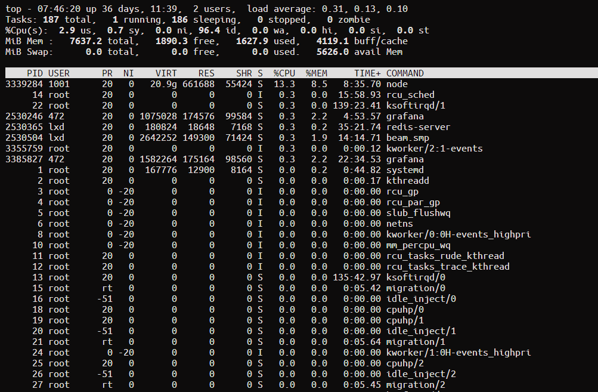
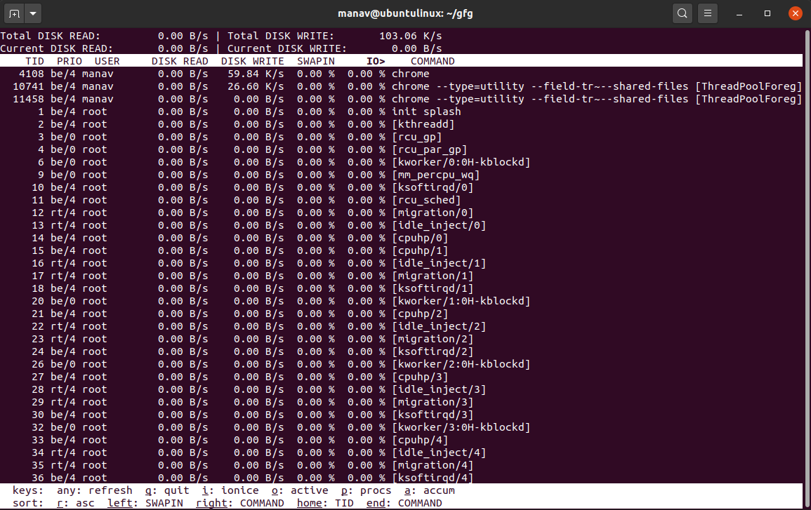

### 5. **Monitoring System Performance:**
Monitoring system performance is crucial for ensuring that a Linux system is running efficiently and identifying potential issues. There are various tools available for monitoring system performance.

1. **top**:

   - `top` is a basic system monitoring tool that provides real-time information about CPU usage, memory utilization, and running processes.

   ```bash
   top
   ```

   - When you run `top`, you'll see a dynamic display of system statistics. Here's a sample output:

   

   - To exit `top`, press `q`.

2. **htop**:

   - `htop` is an improved version of `top` with a more user-friendly interface and additional features.

   ```bash
   sudo apt install htop  # Install if not already installed
   htop
   ```

   - `htop` provides a more visually appealing and customizable view of system performance. Sample output:

   

   - Press `F10` to exit `htop`.

3. **iotop**:

   - `iotop` focuses on monitoring disk I/O (input/output) activity, which can help identify processes that are using the disk heavily.

   ```bash
   sudo apt install iotop  # Install if not already installed
   iotop
   ```

   - `iotop` displays disk I/O statistics for running processes. Sample output:

   

   - Press `q` to exit `iotop`.

4. **vmstat**:

   - `vmstat` provides information about system performance, including CPU, memory, and virtual memory statistics.

   ```bash
   vmstat 5
   ```

   - This command runs `vmstat` with a 5-second interval. Sample output:

   

   - Press `Ctrl+C` to stop `vmstat`.

5. **sar**:

   - `sar` (System Activity Reporter) collects, reports, and saves system activity information. It offers detailed historical data.

   ```bash
   sudo apt install sysstat  # Install if not already installed
   sar -u 5
   ```

   - This command runs `sar` with a 5-second interval and displays CPU utilization. Sample output:

   

   - Press `Ctrl+C` to stop `sar`.

